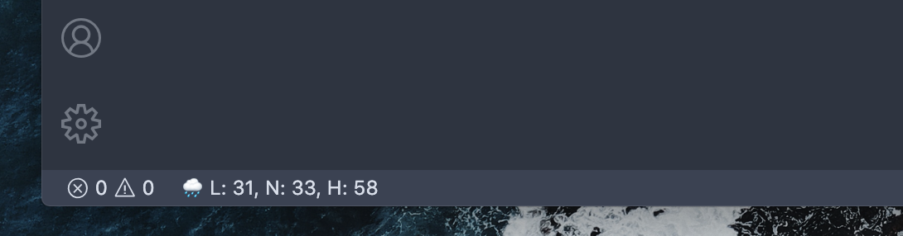

# VS Code Ethereum Price Extension

## About

Get the current Ethereum price in the VS Code status bar:

* E-U - means the eth-usd
* E-B - means the eth-btc

The extension shows emoji to indicate the current price status:

* 🌤 - means the price is low
* 🌧 - means the price is high
* 🌩 - means the price is extremely high

## Need Help

If you need any help, please contact me via GitHub issues page: [GitHub](https://github.com/chowchikwan/vscode-ethereum-price/issues)
